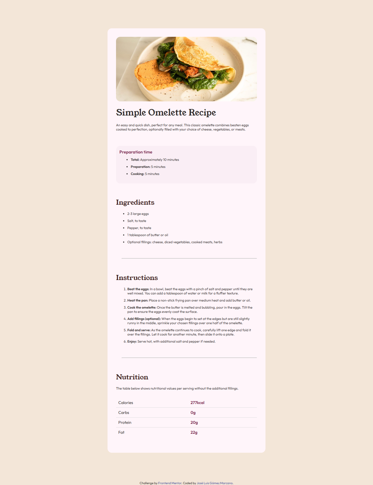

<h1>Recipe Page - Frontend Mentor Challenge</h1>
<h3>Level: Newbie</h3>
<h3>Technologies: HTML - CSS</h3>
This challenge helped me focus on writing semantic HTML. Making sure to think about which HTML elements are most appropriate for each piece of content.
This is a solution to the <a href='https://www.frontendmentor.io/challenges/recipe-page-KiTsR8QQKm'>Recipe page challenge on Frontend Mentor</a>. Frontend Mentor challenges help me improve my coding skills by creating realistic projects. 

<h2>Table of contents</h2>

- [Overview](#overview)
  - [The challenge](#the-challenge)
  - [Screenshot](#screenshot)
  - [Links](#links)
- [My process](#my-process)
  - [Built with](#built-with)
  - [What I learned](#what-i-learned)
  - [Continued development](#continued-development)
  - [Useful resources](#useful-resources)
- [Author](#author)
- [Acknowledgments](#acknowledgments)

<h2 id='overview'>Overview</h2>
<h3 id='the-challenge'>The Challenge</h3>
The challenge was to create a recipe page using HTML and CSS in such a way that it was as close as possible to the original style. I took the opportunity to use an HTML header and semantics template I created for all future projects. I also used a template of CSS elements that will always be repeated.
<h3 id='screenshot'>Screenshot</h3>

